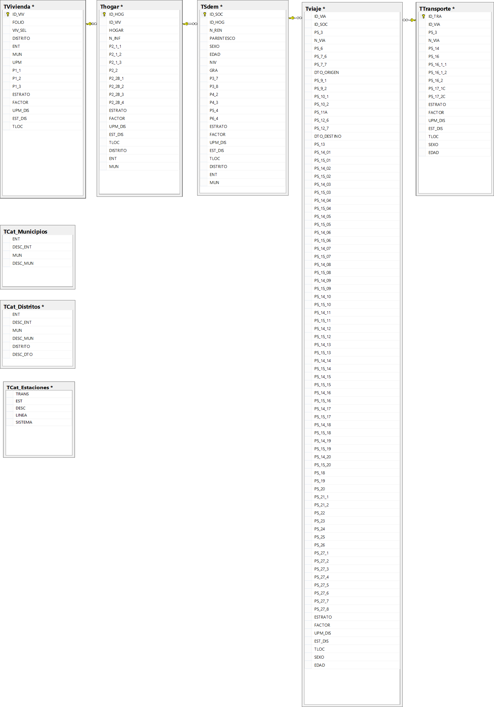

---
title: "**Presentación**"
--- 
  
<div class=text-justify>
    
<br>
<br>
<br>

<div class=text-justify>

# **Proyecto: Análisis sobre las variables asociadas a los viajes de la Encuesta origen Destino de la Zona Metropolitana del Valle de México (EOD) 2017.**


<br>
<br>
<br>
 

## Presentan:

  - **Genny Patricia Esparza Ruiz**  
  - **Alfonso Millán Licona**  
  - **Gustavo Coronado Ramírez**  
  - **Raúl Mejía González**  

<br>
<br>
<br>
 
## Objetivo general del proyecto

<br>

Efectuar un análisis sobre las relaciones entre las variables de la Encuesta Origen Destino de la Zona Metropolitana del Valle de México (EOD) 2017, referente a sus características tales como: motivo, duración, medios de transporte y horario de desplazamientos, utilizando para ello técnicas de análisis multivariado.

<br>
<br>

## Objetivos Específicos:

<br>

1. Analizar las variables relacionadas con los viajes captados en la EOD 2017, en las que es posible aplicar técnicas de análisis multivariado, a efecto de identificar sus posibles relaciones, disminuir su dimensionalidad, o agruparlas según sus similaridades.

2. Ensayar las técnicas de análisis multivariado aprendidas durante el curso, aplicándolas a un ejemplo con información real proveniente de una fuente INEGI.

3. Generar y mostrar algunos resultados en forma ilustrativa de las técnicas de análisis multivariado que se apliquen a los datos.


<br>
<br>

## Justificación

<br>

Las técnicas estadísticas multivariadas permiten establecer a partir de numerosos datos y variables, ciertas relaciones, investigar estructuras latentes y ensayar diversas maneras de organizar dicha información, ya sea transformando y presentando los datos bajo una forma nueva más asequible, o bien agrupando, o bien reduciendo su dimensionalidad sin perder demasiada información, hasta componer un resumen lo más completo posible del conjunto de datos original.

Es de este modo que, habiendo aprendido a lo largo de este curso algunas de estas técnicas, decidimos buscar una fuente de información que nos brindara la oportunidad de explorar variables en las que la aplicación de técnicas multivariadas pudiera revelar resultados interesantes. Estamos convencidos de que la EOD 2017 cumple con este requisito.

Adicionalmente, por la naturaleza de nuestras actividades profesionales, nos encontramos familiarizados con la estructura de las bases de datos de este tipo de encuestas, así como con los metadatos y aspectos relacionados con el diseño conceptual y la estrategia operativa que se sigue en su captación.

Finalmente, es importante mencionar desde el inicio que, dada la naturaleza ilustrativa de los resultados que se obtendrán, el análisis y procesamiento de la información que se hará se restringe única y exclusivamente a los datos en su forma muestral, es decir, sin presentar la inferencia o expansión que surge de forma natural como parte del diseño de la muestra, y que se encuentran implícita en los pesos o ponderadores de la base de datos (factores de expansión). Lo anterior implica que trataremos a los datos como si estos provinieran de una muestra aleatoria simple, por lo que los resultados que se presentarán no serán estrictamente representativos de la población objetivo de la encuesta. 

<br>
<br>


## Breve descripción de la EOD 2017

<br>


Las Encuestas de Origen - Destino (EOD) son una fuente de información
sobre la movilidad espacial cotidiana; recopilan datos del volumen y
dirección de los flujos diarios de población y proporcionan también una
imagen detallada de los patrones de viaje (modos de transporte,
horarios, fines de desplazamiento, etc.). Con estos estudios se generan
datos útiles para la planeación de la infraestructura vial, la relación
entre estructura urbana y desplazamientos, así como para el análisis de
los vínculos entre características sociodemográficas y movilidad
habitual.

El INEGI junto con expertos del Instituto de Ingeniería de la Universidad
Nacional Autónoma de México (UNAM), a solicitud de los gobiernos de
la Ciudad de México y el Estado de México, acordaron realizar el
levantamiento de la Encuesta Origen-Destino en Hogares de la
Zona Metropolitana del Valle de México(EOD) 2017.

Los objetivos de la encuesta fueron:

  • Obtener información que permitiera conocer la movilidad cotidiana de los habitantes de la Zona Metropolitana del Valle de México y las
características de los viajes que realizan. Estimar la cantidad de viajes que se generan en la ZMVM en un día.

  •  Estimar la población de 6 años y más que realiza viajes en los
días señalados entre semana (martes, miércoles o jueves) y el sábado.

  • Conocer los modos de transporte empleados para llegar al destino final
del viaje (incluyendo el de caminar).

  • Detectar las horas de mayor afluencia de los viajes.

  • Captar el motivo, duración, medios de transporte utilizados, tiempo
y el costo de transportación, entre otros.

  • Relacionar las características sociodemográficas de los integrantes del
hogar con los viajes que realizan.

Para lograr la captación de los datos, a cada persona de 6 años y
más, se entregó un
Instructivo de llenado y
tarjeta de viajes, que fue el
instrumento de apoyo que
tanto el informante como el
entrevistador usaron para
obtener la información sobre
los viajes. Se captaron tanto los viajes realizados por la persona entre semana (un día entre martes y jueves), como los que realizó en sábado.

Los temas captados sobre los viajes fueron: total de viajes, lugar de
origen y destino, hora de inicio y término, dirección y propósito del
viaje; modos de transporte, número de veces y orden en que usó los
modos de transporte, costo del mismo, estación de descenso; si viajó
en automóvil particular, número de personas en el vehículo y lugar de
estacionamiento, entre otras variables. 

Para un mayor detalle de los resultados y pormenores de la encuesta, se recomienda consultar el siguiente documento: 

<br>
<br>


<iframe src="archivos/resultados_eod_2017.pdf" style="width:100%; height:550px;" frameborder="0"></iframe>

<br>
<br>
<br>
<br>

### **Base de datos de la EOD 2017**

<br>

La base de datos de la EOD 2017 se conforma por las tablas siguientes:

- **TVivienda.** Contiene información sobre el número de residentes y el total de hogares en la vivienda.

- **THogar.** Con información sobre el número y cacracterísticas de los vehículos que hay en el hogar.

- **TSDem.** En ella se encuentran las características de los residentes del hogar, identificación de las personas que realizaron viajes y el número de viajes que realizaron.

- **TViaje.** En esta tabla se encuentra la descripción de los viajes, con variables como origen, propósito, destino, hora de inicio y término de los viajes, así como los medios de transporte que la persona usó, entre otras.

- **TTransporte.** Contiene el detalle de los tramos realizados según el transporte utilizado, para cada viaje.

- **TCat_Distritos.** Tabla con el catálogo de los distritos en los que se dividió la Zona Metropolitana del Valle de México (ZMVM).

- **TCat_Municipios.** Catálogo de los municipios de la ZMVM que fueron cubiertos por la encuesta.

- **TCat_Estaciones.** Contiene el catálogo de las estaciones del Metro, Metrobús-Mexibús, Tren ligero, Tren suburbano y Mexicable de la ZMVM.

<br>

La descripción detallada de las variables que estas tablas contienen, se puede consultar en el siguiente archivo FD:

<br>

<iframe width="700" height="450" frameborder="0" scrolling="no" src="https://onedrive.live.com/embed?resid=B1C61545BBEEC34C%21774&authkey=%21ALsb7VUTRexEiKg&em=2&wdAllowInteractivity=False&wdHideGridlines=True&wdHideHeaders=True&wdDownloadButton=True&wdInConfigurator=True"></iframe>


<br>

El Diagrama Entidad-Relación de la base de datos es el siguiente:

<br>


```{r i1, fig.align='center', echo=FALSE, out.width = "100%", cache=TRUE}



```

</div>


